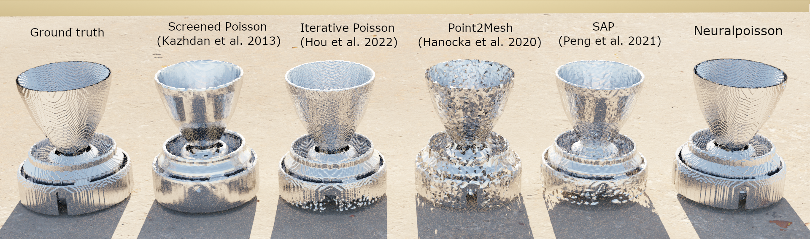

# Neuralpoisson

### [**Paper**](https://arxiv.org/abs/2308.01766) | [**Project Page**](https://juliushege.com/poissonnet/)



This repository contains the implementation of the paper:

Neuralpoisson: Resolution-Agnostic Neural Shape Reconstruction

We are currently working on a cleaned-up version of this code that includes more documentation and pre-trained weights. If you find our code or paper useful, please consider citing
```bibtex
@article{anonymous,
  title={Neuralpoisson: Resolution-Agnostic Neural Shape Reconstruction},
  author={Anonymous},
  journal={arXiv preprint},
  year={2023}
}
```


## Installation

You need to first install all the dependencies. For that you can use [anaconda](https://www.anaconda.com/). 

You can create an anaconda environment called `poissonnet` using
```
conda env create -f environment.yaml
conda activate neuralpoisson
```

## Training - Quick Start

First, download the data from: [ShapeNetsem dataset](https://shapenet.org/download/shapenetsem) and place the binvox files inside `./data`. Then run the script `scripts/generate_training_data_shapenet.py` to generate the training data, modifying the corresponding paths. After the training data has been generated one can simply train the model by running `scritps/train_shapenet.py`.

## Inference

Use the notebook `examples/Inference.ipynb` to evaluate the model on different shapes. You can download our pretrained weights from this [link](https://drive.google.com/drive/folders/1mJqQeDr0lkieeYQdT2WNTBTHgtSdIEa-?usp=sharing).
