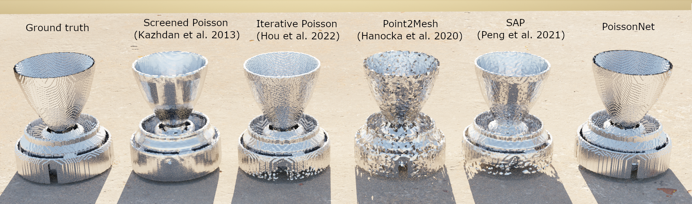

# PoissonNet

### [**Paper**]() | [**Project Page**]()  <br>



This repository contains the implementation of the paper:

PoissonNet: Resolution-Agnostic 3D Shape Reconstruction using Fourier Neural Operators 

**3DV Submission**  


If you find our code or paper useful, please consider citing
```bibtex
@article{andrade2023poissonnet,
  title={PoissonNet: Resolution-Agnostic 3D Shape Reconstruction using Fourier Neural Operators},
  author={Andrade-Loarca, Hector and Bacho, Aras and Hege, Julius and Kutyniok, Gitta},
  journal={arXiv preprint},
  year={2023}
}
```


## Installation

You need to first install all the dependencies. For that you can use [anaconda](https://www.anaconda.com/). 

You can create an anaconda environment called `poissonnet` using
```
conda env create -f environment.yaml
conda activate poissonnet
```

## Training - Quick Start

First, run the script to get the demo data:

```bash
bash scripts/download_data.sh
```
